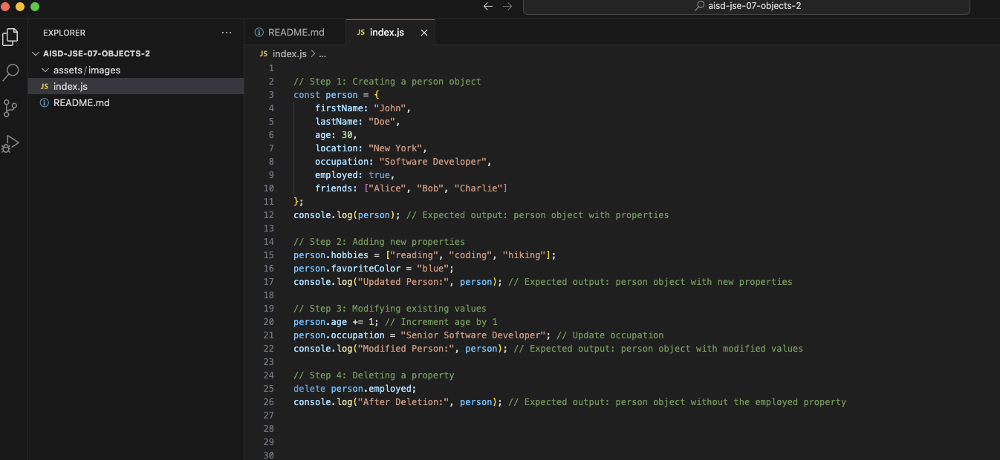

# JavaScript Basics: Objects (Part Two)


## Description 📄
In this project, you will continue practicing working with objects in JavaScript. Building on the previous example we created in our "ObjectsPartOne" project, you will modify the `person` object by adding new fields, updating existing values, and deleting properties. This hands-on experience will enhance your understanding of object manipulation and data management in JavaScript.

## Expected Project Structure 🏗️
Your project will have the following structure:
```
ObjectsPartTwo/
└── index.js
```

# Instructions ✅

## 1. **Create the Project Folder and File**
You will begin by setting up your project structure.

- [ ] Create a folder named `ObjectsPartTwo` to store your project files.
- [ ] Inside the `ObjectsPartTwo` folder, create a file named `index.js`. This file will contain all your JavaScript code.

## 2. **Set Up the Initial Person Object**
You will start by re-creating the `person` object from the previous activity.

- [ ] In your `index.js` file, add the following code to create a `person` object with the specified properties:

```javascript
// Step 1: Creating a person object
const person = {
    firstName: "John",
    lastName: "Doe",
    age: 30,
    location: "New York",
    occupation: "Software Developer",
    employed: true,
    friends: ["Alice", "Bob", "Charlie"]
};
console.log(person); // Expected output: person object with properties
```

- [ ] Run your JavaScript file in the terminal with the command `node index.js` to see your object.

**Expected Output:**
```
{
    firstName: "John",
    lastName: "Doe",
    age: 30,
    location: "New York",
    occupation: "Software Developer",
    employed: true,
    friends: ["Alice", "Bob", "Charlie"]
}
```

**Explanation:**
- The variable `person` holds an object with various properties describing a person, including their name, age, location, occupation, employment status, and an array of friends.

## 3. **Add New Properties**
You will now add new properties to the `person` object, such as `hobbies` and `favoriteColor`.

- [ ] Update your `index.js` file with the following code to add these properties:

```javascript
// Step 2: Adding new properties
person.hobbies = ["reading", "coding", "hiking"];
person.favoriteColor = "blue";
console.log("Updated Person:", person); // Expected output: person object with new properties
```

- [ ] Run your JavaScript file in the terminal with the command `node index.js` to see the updated object.

**Expected Output:**
```
Updated Person: {
    firstName: "John",
    lastName: "Doe",
    age: 30,
    location: "New York",
    occupation: "Software Developer",
    employed: true,
    friends: ["Alice", "Bob", "Charlie"],
    hobbies: ["reading", "coding", "hiking"],
    favoriteColor: "blue"
}
```

**Explanation:**
- This code adds new properties to the `person` object. `hobbies` is set to an array of strings, and `favoriteColor` is set to a string. You can access these properties using dot notation.

## 4. **Modify Existing Values**
Next, you will modify the existing values in the `person` object, such as changing the `age` and updating the `occupation`.

- [ ] Add the following code to your `index.js`:

```javascript
// Step 3: Modifying existing values
person.age += 1; // Increment age by 1
person.occupation = "Senior Software Developer"; // Update occupation
console.log("Modified Person:", person); // Expected output: person object with modified values
```

- [ ] Run your JavaScript file in the terminal with the command `node index.js` to see the result.

**Expected Output:**
```
Modified Person: {
    firstName: "John",
    lastName: "Doe",
    age: 31,
    location: "New York",
    occupation: "Senior Software Developer",
    friends: ["Alice", "Bob", "Charlie"],
    hobbies: ["reading", "coding", "hiking"],
    favoriteColor: "blue"
}
```

**Explanation:**
- The `age` property is updated by incrementing it by 1 using the `+=` operator. The `occupation` property is modified to reflect a new job title. This demonstrates how to change existing values in an object.

## 5. **Delete a Property**
Now, you will learn how to delete a property from the `person` object, such as the `employed` status.

- [ ] Update your `index.js` with the following code:

```javascript
// Step 4: Deleting a property
delete person.employed;
console.log("After Deletion:", person); // Expected output: person object without the employed property
```

- [ ] Run your JavaScript file in the terminal with the command `node index.js` to see the result.

**Expected Output:**
```
After Deletion: {
    firstName: "John",
    lastName: "Doe",
    age: 31,
    location: "New York",
    occupation: "Senior Software Developer",
    friends: ["Alice", "Bob", "Charlie"],
    hobbies: ["reading", "coding", "hiking"],
    favoriteColor: "blue"
}
```

**Explanation:**
- The `delete` operator removes the `employed` property from the `person` object, demonstrating how to remove properties when they are no longer needed.

## 6. **Test Your Knowledge**
Consider adding other properties to the `person` object, such as `married` (boolean) or `pets` (array of strings), and practice accessing, modifying, and deleting these properties.

## 7. **Commit and Push to GitHub**
Ensure you commit your work to your local Git repository and push it to GitHub.

# Conclusion 📄
In this project, you learned how to modify objects in JavaScript by adding new properties, updating existing values, and deleting properties. These skills are essential for managing dynamic data effectively in your JavaScript programs.

---

### Solution Codebase 👀
🛑 **Only use this as a reference** 🛑

💾 **Not something to copy and paste** 💾

**Note:** This lab references a solution file located [here](https://github.com/HackerUSA-CE/aisd-jse-08-objects-2/tree/solution) (link not shown).
